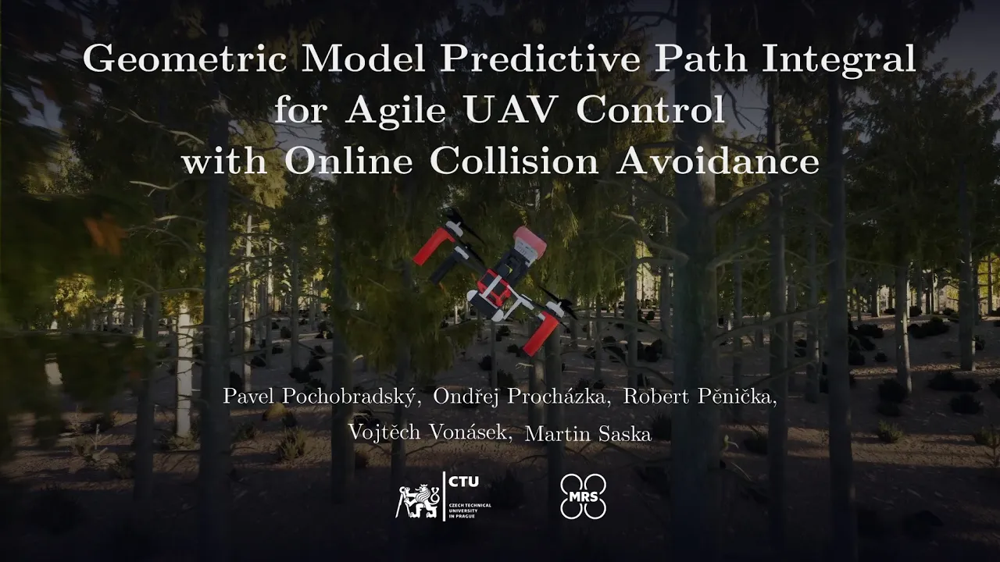

<div align="center">
    <h2>Geometric Model Predictive Path Integral for Agile UAV Control with Online Collision Avoidance</h2>
    <br>
        <a href="https://mrs.fel.cvut.cz/members/master-students/pavel-pochobradsky" target="_blank">Pavel Pochobradský</a>,
        <a href="https://mrs.fel.cvut.cz/members/phdstudents/ondrej-prochazka" target="_blank">Ondřej Procházka</a>,
        <a href="https://mrs.fel.cvut.cz/members/professors/penicka" target="_blank">Robert Pěnička</a>,
        <a href="https://mrs.fel.cvut.cz/members/professors/vonasek" target="_blank">Vojtěch Vonásek</a>, and
        <a href="https://mrs.fel.cvut.cz/members/martin-saska" target="_blank">Martin Saska</a>
        <p>
            <h48>
                <br>
               
                <br>
            </h8>
        </p>
        <a href='https://arxiv.org/abs/2510.12924'></a>
        <a href='youtube.com/watch?v=HEo4MQNX6xc&feature=youtu.be'></a>
    <br>
    <br>
</div>

# The code is going to be released after the paper is published!

## Paper and Citation 

If you use this work in your research to build on it, or for comparison, or if you find it useful, please consider citing the following paper:
``` bibtex
@article{pochobradsky2025geometric,
  title={Geometric Model Predictive Path Integral for Agile UAV Control with Online Collision Avoidance},
  author={Pochobradsk{\`y}, Pavel and Proch{\'a}zka, Ond{\v{r}}ej and P{\v{e}}ni{\v{c}}ka, Robert and Von{\'a}sek, Vojt{\v{e}}ch and Saska, Martin},
  journal={arXiv preprint arXiv:2510.12924},
  year={2025}
}
```
(Click for video demo)
[](https://youtu.be/HEo4MQNX6xc?si=cxWlYuL3HKGSVCiY)
